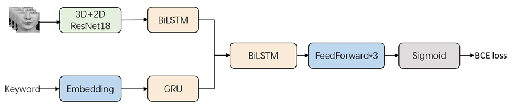

<h1 align="center">MAVSR2025 Track2 Baseline</h1>

## Introduction

This repository contains the baseline code for the MAVSR2025 Track2 competition, aimed at achieving basic visual keyword spotting (KWS). The model architecture is illustrated below:



## Preparation

### Install Dependencies

Run the following command to install the required dependencies:

```Shell
pip install -r requirements.txt
```

### Download Dataset

To access the CAS-VSR-S101 dataset, please complete and scan the signed agreement available [here](https://github.com/VIPL-Audio-Visual-Speech-Understanding/AVSU-VIPL/blob/master/CAS-VSR-S101-Release%20Agreement.pdf). Email the signed agreement to `lipreading@vipl.ict.ac.cn`.

**Important Notes:**
- The dataset is available exclusively for universities and research institutions for research purposes.
- The agreement must be signed by a full-time staff member (usually your tutor).
- Sharing the dataset with others is not allowed under the terms of the agreement.

### Preprocess Dataset

Navigate to the `data` directory to process and prepare the dataset.

Place the downloaded CAS-VSR-S101 dataset in `data/CAS-VSR-S101_zip/lip_imgs_112` and run the following script:

```Shell
python zip2pkl_101.py
```

**Note:** After processing, all video files will be trimmed to start at the `start_frame` and end at the `end_frame`. The baseline workflow is based on `.pkl` files.

## Training

Run `main.py` to train the model:

```Shell
python main.py
```

To monitor the training progress, use TensorBoard:

```Shell
tensorboard --logdir /path_to_your_logdir/
```

Model configurations can be found in `config.py`. Make sure to modify this file as needed to ensure the program functions as expected.

## Testing

We select 2000 videos and 300 words from the validation set for testing. Run the following command to evaluate the model:

```Shell
python test.py
```

## Results

The table below shows the baseline model's performance on the CAS-VSR-S101 dataset for the validation set:

| mAP on Validation Set |
| :--------------------: |
|         18%          |

## Contact

For questions or further information, please contact:

- **Email:** lipreading@vipl.ict.ac.cn
- **Organization:** Institute of Computing Technology, Chinese Academy of Sciences

